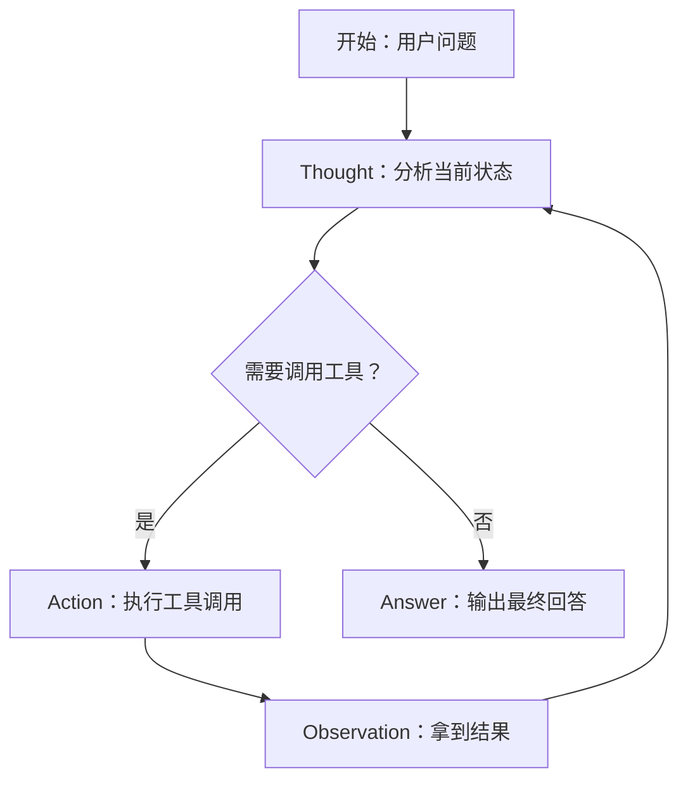
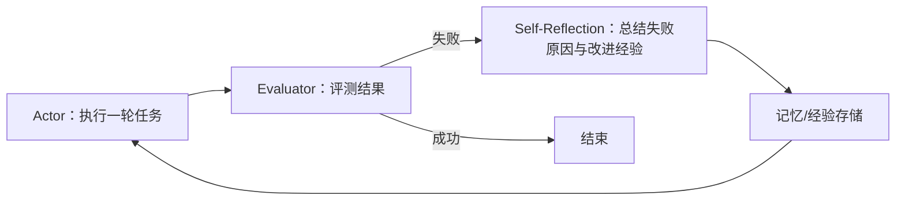

# Agent基础温习（一）：基础范式比较：ReAct、Plan-and-Solve、Reflection

这是"Agent 基础温习"系列的第一篇。大语言模型（LLM）本身只会"生成下一段文字"，要让它在真实任务里稳定地解决问题，需要给它套上一层循环：**推理 -> 行动 -> 观察 -> 再推理**。这层循环怎么做，学术界和工程界沉淀出了几种基础范式。本文从概念、原理、特性、使用场景和优劣势五个角度，对比最常被提到的三种：**ReAct**、**Plan-and-Solve** 和 **Reflection**。

## 1. 背景：从"一次问答"到"Agent 循环"

在 Agent 范式出现之前，大家先意识到了 **思维链（Chain-of-Thought, CoT）** 的价值：让模型在给出答案前先写出中间推理步骤，能显著提升复杂推理的准确率（Wei et al., 2022）。CoT 是"想清楚再回答"。

但真实的智能体任务往往需要**动手**：查资料、算数字、写代码、操作环境。于是"思考"与"行动"如何组织，就成了范式设计的核心问题：

- 边想边做，一步一步来？
- 先通盘规划，再集中执行？
- 做完之后回头检查、修正自己？

这正是 ReAct、Plan-and-Solve、Reflection 三种范式各自的答案。它们不是三条互斥的路线，而是三个可组合的**能力模块**：现代 Agent 框架几乎都是"规划 + 执行 + 反思 + 记忆 + 工具"的复合体。

## 2. ReAct：边推理边行动

### 2.1 基本概念

ReAct 全称 **Reasoning + Acting**，出自论文 *ReAct: Synergizing Reasoning and Acting in Language Models*（Yao et al., ICLR 2023）。核心思想是让模型在每轮交替输出两种内容：

- **Thought（思考）**：说明当前推理，决定下一步做什么；
- **Action（行动）**：调用一个具体动作，如查询搜索引擎、执行代码、操作环境；
- **Observation（观察）**：工具或环境返回的结果，作为下一步思考的输入。

循环往复，直到模型认为可以给出最终回答（Answer）。

### 2.2 核心原理

ReAct 的本质是**把推理轨迹（reasoning trace）与动作轨迹（action trace）交错起来**。推理轨迹帮助模型保持推理的一致性、可解释性和可控性；动作轨迹让模型能接触外部信息源，用真实观察来纠正推理。

以"查证事实的问答"为例：模型先思考"这个问题我不确定，需要搜索"，于是调用搜索工具；拿到检索结果后再思考"结果里有没有答案，还需要补充什么"，可能再搜一次；最后组织回答。这比让模型"凭记忆硬答"更能缓解幻觉——因为关键事实有外部结果做锚点。

### 2.3 特性

- **可解释**：Thought 是可见的中间推理，方便调试与审计。
- **与环境交互**：天然对接工具调用（搜索、计算器、代码执行、GUI 操作等）。
- **强泛化提示词实现**：ReAct 只需要把"思考/行动/观察"的示例写进提示词即可工作，无需微调模型。

### 2.4 使用场景

- 需要**多步工具调用**的问答与任务：搜索、查库、计算、读写文件。
- 有明确动作集合的交互环境：网页购物（WebShop）、家庭任务（ALFWorld）、代码执行等基准任务。
- 现代 Agent 框架的**默认单步执行器**：LangChain 的 ReAct agent、各类 function calling 循环，思路与 ReAct 同源。

### 2.5 优劣势

**优势**

- 推理与行动相互促进：行动结果修正推理，推理引导有效行动。
- 相比"只行动不思考"，幻觉更少、可控性更高。
- 实现简单、生态成熟，是最容易落地的 Agent 范式。

**劣势**

- **局部视角**：每一步只决定"下一步做什么"，缺少对整条任务路径的全局规划，长任务容易迷失或绕路。
- **循环风险**：工具调用可能失败或陷入重复尝试，消耗大量 token 和时间（需要最大步数、超时等防护）。
- 最终质量强依赖**单步动作的可靠性**：一步执行错，后续推理可能被带偏且不自知。

## 3. Plan-and-Solve：先规划，再执行

### 3.1 基本概念

Plan-and-Solve 出自论文 *Plan-and-Solve Prompting: Improving Zero-Shot Chain-of-Thought Reasoning by Large Language Models*（Wang et al., ACL 2023）。它针对 CoT 提示词中那句著名的 "Let's think step by step" 做了改进：与其让模型边想边写，不如先要求它**生成完整的解题计划**，然后**再按计划一步步求解**。

### 3.2 核心原理

论文认为 zero-shot CoT 在复杂问题上容易犯三类错误：**计算错误、缺步（遗漏必要条件）、过早给出结论**。Plan-and-Solve 通过把任务拆成两个阶段缓解这些问题：

1. **规划阶段（Plan）**：要求模型先提取问题中的变量、条件和目标，产出一份分步骤的执行计划。
2. **求解阶段（Solve）**：要求模型严格依据计划逐步执行，并给出中间结果。

论文还提出增强版 **PS+**：在规划指令中加入"注意计划要足够细致、一步一检查"等细化要求。整个过程是 **zero-shot** 的——不需要像标准 CoT 那样手工准备推理示例。

### 3.3 特性

- **全局视角**：先看到完整路径，再做局部执行，天然适合任务分解。
- **零样本可用**：无需 few-shot 示例，适合快速接入。
- **以提示词形式存在**：与具体模型、工具解耦，可以自由叠加在其它范式之上。

### 3.4 使用场景

- **复杂数学与逻辑推理**：GSM8K、MultiArith 等需要多步计算的基准。
- **任务规划类 Agent 的"开局"**：Agent 收到复杂目标时，先用 Plan-and-Solve 式提示产出任务清单，再逐项执行。
- 与"执行器"结合形成 **Plan-and-Execute**：先规划，再让 ReAct 式的执行器逐条完成。

### 3.5 优劣势

**优势**

- 弥补 ReAct 的"短视"：先有全局计划，避免执行中途迷失方向。
- 对零样本场景友好，提示词改动小、可移植性强。
- 计划本身可读可检查，便于人在环上干预。

**劣势**

- **计划是静态的**：一旦环境与计划假设不符（信息缺失、工具失败），计划不会自我修正。
- 计划质量决定上限：如果开局计划就错了，后续执行会沿错误路径放大错误。
- 纯粹提示词层面的"规划"不等于真正的任务规划器（如 LLM 规划 + 形式化验证），复杂场景下仍需要更工程化的规划组件。

## 4. Reflection：干完，回头审视自己

### 4.1 基本概念

"反思"是一类范式的统称，最具代表性的工作是 **Reflexion**（Shinn et al., NeurIPS 2023）。它把 Agent 的失败经验转化为**语言形式的强化信号**：任务失败后，Agent 反思"为什么失败、下次该怎么做"，把教训写进记忆，下一轮尝试时带上这些经验。

同一思想下的另一个代表是 **Self-Refine**（Madaan et al., NeurIPS 2023）：让模型对自己的输出做"生成 -> 反馈 -> 修正"的迭代，不需要外部工具或额外训练。

### 4.2 核心原理

Reflexion 的循环包含四个角色：

- **Actor**：基于当前任务和历史经验生成尝试（论文中常用 ReAct 作为 Actor）。
- **Evaluator**：对尝试结果打分/判断，可以是模型自评、单元测试、环境回报或人工。
- **Self-Reflection**：失败时生成一段结构化反思，回答"我哪里做错了、下次如何改进"。
- **Memory**：把反思保存下来，供后续尝试参考（Reflexion 里叫 episodic memory）。

它与"盲目重试"的本质区别在于：**经验以自然语言沉淀下来**，Agent 是在"带着教训"地重试，而不是无状态地再来一次。论文在 HumanEval 等代码任务上报告，Reflexion 能显著提升 pass@1（例如 GPT-4 达到约 91%），在 ALFWorld、WebShop 等决策任务上同样有效。

### 4.3 特性

- **自我改进**：不需要微调模型，纯靠提示词和记忆机制提升成功率。
- **可积累**：反思经验可以跨轮次、跨任务复用（适合持续运行的服务型 Agent）。
- **依赖评测信号**：整个循环的质量取决于"怎么判断成败"。

### 4.4 使用场景

- **代码生成与修复**：用单元测试当 Evaluator，失败的用例驱动反思修正。
- **对话与内容生成**：让模型自评回答质量并重写（Self-Refine 风格）。
- **长期运行的 Agent**：把每次任务教训累积进记忆库，越用越"老练"。

### 4.5 优劣势

**优势**

- 把"失败"变成资产，样本效率高，少样本下提升明显。
- 实现相对轻量：评估器 + 反思提示词 + 记忆即可，无需训练。
- 能覆盖 ReAct/Plan-and-Solve 的盲区——**执行完后没有自我检查**的问题。

**劣势**

- **需要可靠的评估信号**：如果"成功/失败"判断不准，反思会往错误方向优化。
- **反思质量不稳定**：模型可能过度修正、改错已验证的部分，或产出空话式反思。
- **迭代成本高**：每轮完整执行 + 评估 + 反思，token 与延迟开销明显，需要设置重试上限。

## 5. 三种范式对比

| 维度 | ReAct | Plan-and-Solve | Reflection |
| --- | --- | --- | --- |
| 时间视角 | 局部（当下这一步） | 全局（开局先规划） | 事后（执行后回看） |
| 核心机制 | 思考/行动/观察 交错循环 | 先产计划再按计划求解 | 执行 -> 评估 -> 反思 -> 再试 |
| 是否需要外部工具/环境 | 通常需要 | 不一定 | 视评估器而定 |
| 是否需要评测信号 | 不需要（靠观察自推进） | 不需要 | 需要（自评/测试/环境回报） |
| 失败处理 | 靠观察调整下一步 | 计划不自我修正 | 沉淀经验后重试 |
| 可解释性 | 高（可见 Thought） | 高（计划可见） | 中（反思文本可见） |
| 代表工作 | ReAct (2023) | Plan-and-Solve (ACL 2023) | Reflexion / Self-Refine (2023) |
| 典型应用 | 工具调用问答、Web 任务 | 数学推理、任务分解 | 代码修复、持续服务 Agent |
| 主要短板 | 局部短视、易循环 | 计划静态、不纠错 | 依赖评估信号、成本高 |

## 6. 组合使用：范式不是互斥的

实际工程中，三种范式经常被组合：

- **Reflexion 内部就用 ReAct 当 Actor**：ReAct 负责"这一轮怎么走"，Reflexion 负责"这轮失败后下一轮怎么变"。
- **Plan-and-Execute**：Plan-and-Solve 产出计划，ReAct 式执行器逐条落地。
- **完整 Agent**：规划（先拆任务）-> 执行（ReAct 循环调工具）-> 反思（失败后总结）-> 记忆（经验沉淀），基本就是生产级 Agent 的标准骨架。

因此理解这三个范式，重点不是"三选一"，而是理解它们分别补足了 Agent 循环的哪一块：**执行的即时性、任务的全局性、过程的自我修正性**。

## 7. 参考文档

1. ReAct 论文：*ReAct: Synergizing Reasoning and Acting in Language Models*（Yao et al., ICLR 2023）— https://arxiv.org/abs/2210.03629
2. Plan-and-Solve 论文：*Plan-and-Solve Prompting: Improving Zero-Shot Chain-of-Thought Reasoning by Large Language Models*（Wang et al., ACL 2023）— https://arxiv.org/abs/2305.04091
3. Reflexion 论文：*Reflexion: Language Agents with Verbal Reinforcement Learning*（Shinn et al., NeurIPS 2023）— https://arxiv.org/abs/2303.11366
4. Self-Refine 论文：*Self-Refine: Iterative Refinement with Self-Feedback*（Madaan et al., NeurIPS 2023）— https://arxiv.org/abs/2303.17651
5. Chain-of-Thought 论文（背景）：*Chain-of-Thought Prompting Elicits Reasoning in Large Language Models*（Wei et al., NeurIPS 2022）— https://arxiv.org/abs/2201.11903
6. Agent 综述（扩展阅读）：*The Rise and Potential of Large Language Model Based Agents: A Survey*（Xi et al., 2023）— https://arxiv.org/abs/2309.07864

> 说明：本文为基础温习性质的技术笔记，论文与基准数据以官方论文为准，建议结合原文进一步阅读。下一期可以继续温习 Agent 的记忆机制或工具调用设计。
