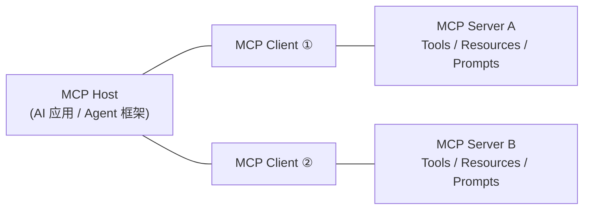
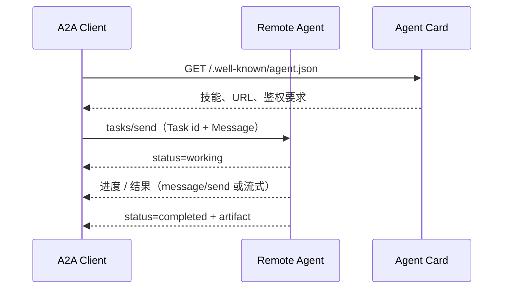

# Agent基础温习（二）：Agent协议：MCP、A2A

这是"Agent 基础温习"系列的第二篇。上一篇复习了 Agent 的内部范式（ReAct、Plan-and-Solve、Reflection），解决的是"单个 Agent 怎么思考和行动"。这一篇把视角拉到**系统之间**：一个 Agent 如何连接外部能力、如何与另一个 Agent 协作。这正是两种开放协议要回答的问题——**MCP**（Model Context Protocol）与 **A2A**（Agent2Agent）。

一句话先记住二者的分工：**MCP 解决"Agent 用工具"，A2A 解决"Agent 找 Agent"**。MCP 是 Agent 与工具/数据源之间的"USB 接口"；A2A 是 Agent 与 Agent 之间的"电子邮件/网络协议"。它们不是竞争关系，而是互补的两个层次。

## 1. 背景：Agent 为什么需要协议

上一篇文章里的 Agent 再聪明，也只在一个进程里自娱自乐。真实场景下它必须：

- **调用外部能力**：查数据库、发邮件、操作 GitHub、读文件系统……这些是"工具"；
- **读取外部上下文**：文档、schema、实时数据……这些是"数据/资源"；
- **与其它 Agent 协作**：让一个"会订机票"的 Agent 配合一个"会排日程"的 Agent，各自发挥特长。

如果没有统一协议，每接一个新工具就要写一套专用集成，每和一家新 Agent 说话就要对一种私有 API——这正是软件工程里最典型的"接口爆炸"。MCP 和 A2A 的目的，都是**把连接标准化**，让"插上就能用"成为可能。

## 2. MCP：Agent 连接工具与数据的协议

### 2.1 基本概念

MCP 由 Anthropic 于 2024 年 11 月开源，定位是 **LLM 应用与外部数据源、工具之间的开放协议**。它的架构里有三个角色：

- **MCP Host**：AI 应用本体（如 Claude Desktop、各种 Agent 框架），负责协调；
- **MCP Client**：Host 内部为每个服务器维持一个连接组件，与服务器一一对应；
- **MCP Server**：暴露工具、数据、提示词的程序，一个 Server 可以服务很多远程 Client。



### 2.2 核心原理

MCP 在架构上分两层：

- **Data Layer（数据层）**：基于 **JSON-RPC 2.0** 的消息协议，负责生命周期管理与核心原语交换。
- **Transport Layer（传输层）**：负责消息的通道、分帧与鉴权。

生命周期上，MCP 是一个**有状态会话**：Client 与 Server 先通过 `initialize` 握手，协商 `protocolVersion` 与双方 `capabilities`，然后才进入业务调用。这样版本不兼容的双方在第一步就会被发现，而不是在运行中神秘报错。

Server 可暴露三类**核心原语**：

| 原语 | 作用 | 类比 |
| --- | --- | --- |
| **Tools** | 可被模型调用的可执行函数（发邮件、查库、跑代码） | 函数的"动词" |
| **Resources** | 提供给模型的上下文数据（文件、schema、API 响应） | 只读的"名词" |
| **Prompts** | 可复用的交互模板（system prompt、few-shot） | 标准操作流程模板 |

配合 JSON-RPC 方法（如 `tools/list`、`tools/call`、`resources/read`），模型可以在运行时**先发现、再调用**：Client 拉取 Server 的工具清单与 JSON Schema，交给模型做 function calling，模型决定调用哪个工具后，由 Client 发 `tools/call` 执行。此外 Server 也可以反过来请求 Host 侧的模型做 `sampling`（补全请求），并支持 `notifications` 做实时变更通知。MCP 规范较新版本还在实验性引入 **Tasks**（可持久化、可查询状态的执行包装），用于耗时长任务。

传输层目前主要是两种：**Stdio**（本地进程，走标准输入输出，性能最好、最安全）与 **HTTP**（远程，客户端 POST + Server-Sent Events 或 Streamable HTTP 回推，支持标准 HTTP 鉴权如 Bearer/OAuth）。2025 年后 MCP 规范也加入了 Authorization 规范，把 OAuth 2.1 等鉴权流程标准化。

### 2.3 特性

- **标准化、开源**：一套接口接所有工具，生态飞速扩张（官方维护多种语言 SDK 与参考实现）。
- **协议与模型解耦**：Server 不需要知道调用它的是哪个模型、哪种框架。
- **能力强声明**：工具自带 JSON Schema 描述，模型可自主发现与调用。
- **本地优先安全**：Stdio 传输让敏感工具只暴露给本机进程。

### 2.4 使用场景

- 给 Claude Code、各类桌面/Web Agent 接入**文件系统、数据库、GitHub、Slack、浏览器**等工具；
- 统一企业内部"工具网关"：一个 MCP Server 封装一组服务，多个 Agent 复用；
- RAG 数据接入：把向量库、文档库包成 Resources/Tools 供 Agent 查询。

### 2.5 优劣势

**优势**

- 生态与工具链最成熟，SDK、调试器（MCP Inspector）、参考实现齐全；
- 语义清晰（工具/资源/提示词三种原语），非常适合"Agent 扩展能力"；
- 本地传输性能好、边界明确。

**劣势**

- **本质是一对多的中心化连接**：Host 到 Server，不解决"两个对等的 Agent 互相对话"；
- Server 之间没有互操作：Agent 想编排多个 Server 的能力，仍需自己写编排逻辑；
- 长任务/异步仍偏实验（Tasks 特性较新），主要面向请求-响应的工具调用。

## 3. A2A：Agent 之间协作的协议

### 3.1 基本概念

A2A（Agent2Agent）由 Google 于 **2025 年 4 月**发布，目标是让**不同厂商、不同框架的 Agent 之间可以相互发现、委托任务、交换结果**。2025 年 6 月 23 日，Google 将该协议捐赠给 **Linux Foundation**，与 AWS、Cisco、Microsoft、Salesforce、SAP、ServiceNow 等共同成立 **Agent2Agent Project**，成为中立组织治理下的开放标准。

它定义两类参与者：

- **Client**：发起任务的 Agent（也叫用户端 Agent / orchestrator）；
- **Remote Agent**：接收并执行任务的 Agent，通过公开的 **Agent Card** 宣告自己的存在与能力。

### 3.2 核心原理

A2A 建立在 **JSON-RPC 2.0 over HTTP(S)** 之上，围绕四个核心机制：

**① Agent Card：能力发现**
每个 Agent 通过一份公开的 JSON 元数据（Agent Card，通常放在 `/.well-known/agent.json`）声明：名称、描述、入口 URL、技能列表（skill，含可输入参数说明）、认证要求、是否支持流式等。Client 先拉取 Agent Card，"读说明书"，再决定是否调用——就像先看餐厅菜单再点菜。

**② Task：异步任务模型**
A2A 的核心抽象是 **Task**：Client 向 Remote Agent 发送一个任务（`tasks/send`），任务有明确生命周期状态：`submitted → working → (input-required ↔ working) → completed / failed / canceled`。



因为任务是有状态的，Client 可以**中断后回来查询**（`tasks/get`、`tasks/cancel`），也支持**推送通知**和**流式**把中间状态实时推给 Client——这天然适配"跨网络、可能要跑很久"的 Agent 协作。

**③ Message / Part：统一的消息结构**
任务内容由 Message 承载，Message 由多个 **Part** 组成：文本（`text`）、文件（`file`）、数据（`data`）等。这种"一个消息可含多种模态"的结构，让 Agent 间不仅能传文字，还能传文件引用与结构化数据。

**④ 能力协商与安全**
与 MCP 在连接期握手类似，A2A 通过 Agent Card 暴露能力与鉴权需求；规范对认证、隐私（如用户偏好、数据用途标注）有明确建议，允许不同 Agent 按各自组织策略控制访问。

### 3.3 与 MCP 的关系：互补的两层

业界（包括 Google 与 Anthropic 官方的表述）已经形成共识：**MCP 给 Agent 提供工具，A2A 让 Agent 之间协作**。

- 一个 Agent **内部**用 MCP 调用工具（查库、发信、读文件）；
- 这个 Agent **对外**用 A2A 把自己的能力开放给其它 Agent，或作为 Client 委托其它 Agent。

可以类比操作系统的分层：MCP 像"系统调用/驱动接口"，A2A 像"网络协议"。二者叠加，才能组成真正的 Agent 网络。

### 3.4 特性与使用场景

特性：

- **跨厂商互操作**：Agent Card + 标准 JSON-RPC，任何框架实现同一协议即可对话；
- **异步长任务一等公民**：Task 状态机、流式、推送通知，适合真实世界的慢任务；
- **多模态消息**：Part 结构支持文本、文件、结构化数据；
- **去中心化**：没有中央总线，Agent 之间点对点。

使用场景：

- 企业内部/跨企业的 **Agent 编排**：排程 Agent 委托"订会议室"Agent、"查航班"Agent，各自厂商实现不同也能协作；
- **多 Agent 工作流**：调研 Agent 产出报告，交给写作 Agent 润色，再由发布 Agent 发布；
- 作为 **Agent 开放平台**：把自己的 Agent 包成 A2A Server，对外提供能力市场。

### 3.5 优劣势

**优势**

- 面向真实 Agent 协作的痛点（发现、长任务、异步、多模态）设计，模型贴合度高；
- Linux Foundation 中立治理，多家大厂背书，互操作前景好；
- 与 MCP 互补而非冲突，可以叠加使用。

**劣势**

- 生态起步晚于 MCP，SDK 与生产案例仍在快速演进；
- "Agent 间信任"是硬问题：谁来认证 Remote Agent、谁能委托什么任务，规范给出框架但落地仍靠各组织策略；
- 对纯"工具接入"场景而言，A2A 的模型比 MCP 重——不需要 Agent 间协作时用它属于过度设计。

## 4. 对比一览

| 维度 | MCP | A2A |
| --- | --- | --- |
| 解决的问题 | Agent ↔ 工具/数据 | Agent ↔ Agent |
| 提出方/治理 | Anthropic → 开放社区规范 | Google → Linux Foundation Agent2Agent Project |
| 通信底座 | JSON-RPC 2.0 | JSON-RPC 2.0 over HTTP(S) |
| 传输 | Stdio / HTTP(SSE、Streamable) | HTTP(S) + 流式/推送 |
| 连接模型 | Host-Client-Server（一对多中心化） | Client-Remote Agent（点对点） |
| 能力声明 | 连接期 initialize 握手协商 capabilities | 公开 Agent Card（/.well-known/agent.json） |
| 核心抽象 | Tools / Resources / Prompts | Agent Card / Task / Message-Part |
| 任务模型 | 以请求-响应为主（Tasks 较新、实验性） | Task 状态机（异步、可查询、可取消）为第一公民 |
| 长任务 | 一般需自行处理 | 原生支持（状态+推送+流式） |
| 生态成熟度 | 高（SDK/Inspector/参考实现多） | 中（快速增长） |
| 典型位置 | Agent 的"手与眼" | Agent 的"社交网络" |

## 5. 简单例子：构建和使用 MCP 与 A2A

> 下面示例用于展示**构建与使用的核心流程**，贴近官方 SDK 的用法；具体 API 随版本演进，运行前请以官方仓库的最新 README 为准。

### 5.1 MCP：用 Python 构建一个极简 Server

MCP 官方 Python SDK 提供 `FastMCP` 快速封装。下面定义了一个带 `get_weather` 工具的天气服务器，通过 `stdio` 传输运行，任何 MCP Host（Claude Desktop、Agent 框架）都能直接连接。

```python
# server.py
from mcp.server.fastmcp import FastMCP

mcp = FastMCP("weather-server")

@mcp.tool()
def get_weather(city: str) -> str:
    """查询指定城市的当前天气。"""
    # 真实实现可在这里调用天气 API
    return f"{city}：晴，25°C"

if __name__ == "__main__":
    mcp.run(transport="stdio")
```

写好后用 MCP Inspector 或任意客户端连接即可。一个极简 Client 如下——先 `initialize`，再 `list_tools` 发现工具，最后 `call_tool` 执行：

```python
import asyncio
from mcp import ClientSession, StdioServerParameters
from mcp.client.stdio import stdio_client

async def main():
    params = StdioServerParameters(command="python", args=["server.py"])
    async with stdio_client(params) as (read, write):
        async with ClientSession(read, write) as session:
            await session.initialize()
            tools = await session.list_tools()
            print("发现工具:", [t.name for t in tools.tools])
            result = await session.call_tool(
                "get_weather", {"city": "上海"}
            )
            print(result.content[0].text)

asyncio.run(main())
```

这段代码就是 MCP 的核心循环：**连接 → 握手 → 发现 → 调用**。模型层（如 function calling）把它串起来，就得到一个"能自己决定用哪个工具"的 Agent。

### 5.2 A2A：声明 Agent Card 并让两个 Agent 对话

先看"能力声明"。每个 A2A Agent 要暴露一份 Agent Card（默认 `/.well-known/agent.json`）：

```json
{
  "name": "天气助手",
  "description": "提供城市天气查询服务",
  "url": "https://agents.example.com/weather",
  "version": "1.0.0",
  "skills": [
    {
      "id": "weather",
      "name": "天气查询",
      "description": "输入城市名返回当前天气",
      "tags": ["weather"]
    }
  ],
  "capabilities": { "streaming": true }
}
```

Client Agent 的流程是：**先 GET 这张 Card 发现能力，再通过 JSON-RPC 发任务**。底层交互长这样（`tasks/send` 提交任务）：

```json
{
  "jsonrpc": "2.0",
  "id": 1,
  "method": "tasks/send",
  "params": {
    "id": "task-001",
    "message": {
      "role": "user",
      "parts": [{ "type": "text", "text": "上海现在天气如何？" }]
    }
  }
}
```

Remote Agent 返回带状态的任务：可能先回 `working`，跑完再回 `completed` 并携带最终产物：

```json
{
  "jsonrpc": "2.0",
  "id": 1,
  "result": {
    "id": "task-001",
    "status": { "state": "completed" },
    "artifacts": [
      {
        "parts": [
          { "type": "text", "text": "上海：晴，25°C，东南风 3 级" }
        ]
      }
    ]
  }
}
```

在实际工程里不必手写这些 JSON——官方 Python SDK（`a2a-python`）与样例仓库（`a2a-samples`）提供了 A2A Server/Client 封装和可直接运行的 hello world（服务端暴露 Agent、客户端发起 Task）。把上一节 MCP 天气工具塞进一个 A2A Server，再让另一个"旅行规划 Agent"作为 Client 来调用它，就构成了"MCP 提供能力 + A2A 对外协作"的完整链路。

## 6. 选型与落地建议

- **只做工具接入**：用 MCP。给已有 Agent 加数据库、加文件、加 API，MCP 生态最省事。
- **要做 Agent 间协作**：用 A2A。把"会做某件事的 Agent"开放给其它 Agent 时，A2A 的 Agent Card + Task 模型是正解。
- **两者都上**：Agent 内部用 MCP 连工具，对外用 A2A 暴露成可被委托的服务；这也是两家官方都认可的分层架构。
- **先小步验证**：MCP 从"包一个内部 API"开始，A2A 从"两个自己写的 Agent 互调"开始，先跑通协议再谈规模化。
- **关注安全**：无论哪种协议，都要管好三件事——谁能连（鉴权）、能干什么（最小权限）、留了什么痕（审计）。远程暴露的工具/Agent 一律默认拒绝内网、限制作用域。

## 7. 参考文档

1. **Model Context Protocol 规范与文档**：https://modelcontextprotocol.io（架构概念：https://modelcontextprotocol.io/docs/2024-11-05/learn/architecture）
2. **MCP 发布公告（Anthropic）**：*Introducing the Model Context Protocol*，https://www.anthropic.com/news/model-context-protocol
3. **MCP Python SDK**：https://github.com/modelcontextprotocol/python-sdk
4. **Agent2Agent (A2A) 协议介绍（Google，2025-04）**：*A2A: A New Era of Agent Interoperability*，https://developers.googleblog.com/en/a2a-a-new-era-of-agent-interoperability/
5. **A2A 规范（Linux Foundation Agent2Agent Project 治理）**：https://a2a-protocol.org/latest/
6. **Linux Foundation 成立 Agent2Agent Project 公告（2025-06-23）**：https://www.linuxfoundation.org/press/linux-foundation-launches-the-agent2agent-protocol-project-to-enable-secure-intelligent-communication-between-ai-agents
7. **A2A Python SDK 与示例**：https://github.com/a2aproject/a2a-python、https://github.com/a2aproject/a2a-samples
8. 本博客系列：《Agent基础温习（一）：基础范式比较：ReAct、Plan-and-Solve、Reflection》。

> 说明：协议规范仍在快速演进（MCP 持续发布新版本规范、A2A 在 Linux Foundation 下迭代），文中对具体版本特性的描述以各官方仓库最新文档为准。本文为温习性质的技术笔记，建议结合官方规范与 SDK 原文进一步实践。
