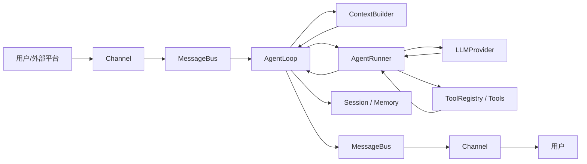

# nanobot 项目学习路线

> 面向 AI 入门学习者的源码阅读路线。目标不是一次读完所有文件，而是建立一个清晰心智模型：一条消息如何进入系统、如何变成 LLM 请求、模型如何调用工具、结果如何保存并返回用户。

## 1. 项目定位

nanobot 是一个轻量级个人 AI Agent 框架，后端主要由 Python 编写，前端 WebUI 使用 React/TypeScript。它的核心目标是把“聊天入口、LLM Provider、工具调用、会话记忆、自动化任务、WebUI”这些组件组合成一个可自托管的 Agent 运行时。

对初学者来说，它值得学习的地方主要有四点：

1. 它不是只调用一次大模型 API，而是实现了完整的 Agent loop。
2. 它把渠道、模型、工具、记忆做成相对清晰的边界，适合学习模块化设计。
3. 它支持真实工程场景里的安全边界，如工作区限制、SSRF 防护、Shell 沙箱。
4. 它有较完整的测试目录，适合边读源码边用测试验证理解。

## 2. 总体代码结构

```text
nanobot/
  agent/              # Agent 核心：上下文构建、主循环、工具执行、记忆、hooks
  agent/tools/        # 模型可调用工具：文件、Shell、Web、MCP、cron、图片生成等
  api/                # OpenAI 兼容 HTTP API
  apps/               # CLI App 扩展协议与服务
  audio/              # 音频转写
  bus/                # 异步消息总线与事件定义
  channels/           # 聊天渠道适配器：WebSocket、Telegram、Slack、Discord 等
  cli/                # 命令行入口：agent、gateway、serve、onboard 等
  config/             # Pydantic 配置 schema、加载、路径解析
  cron/               # 定时任务与自动化执行
  gateway/            # gateway 运行服务
  pairing/            # 渠道私聊配对与授权
  providers/          # LLM Provider 适配层
  security/           # 工作区、网络、安全策略
  session/            # 会话存储、压缩、持续目标状态
  skills/             # 内置技能说明文件
  templates/          # Agent 系统提示词模板
  triggers/           # 本地触发器
  utils/              # 通用工具函数
  webui/              # 后端 WebUI 支撑 API

webui/
  src/                # React/TypeScript 前端源码
  src/lib/            # WebSocket 客户端、API、格式化、运行时工具
  src/components/     # UI 组件
  src/hooks/          # React hooks
  src/tests/          # 前端测试

docs/                 # 使用文档、架构文档、配置文档
tests/                # Python 测试，基本按 nanobot/ 模块镜像组织
.agent/               # 面向代码代理的设计、安全、注意事项说明
```

## 3. 系统设计总览

nanobot 的核心链路可以概括为：



一条普通消息的生命周期：

1. 渠道层收到用户消息，例如 WebUI、CLI、Telegram、Slack。
2. 渠道把消息包装成 `InboundMessage`，放入 `MessageBus.inbound`。
3. `AgentLoop` 从总线消费消息，决定 session key，恢复会话，构建上下文。
4. `ContextBuilder` 组装 system prompt、记忆、技能、历史消息、当前用户输入。
5. `AgentRunner` 把消息发给当前 `LLMProvider`。
6. 如果模型返回 tool calls，`AgentRunner` 通过 `ToolRegistry` 执行工具。
7. 工具结果作为 `tool` 消息追加回对话，再次请求模型，直到得到最终回答或达到限制。
8. `AgentLoop` 保存会话，把 `OutboundMessage` 发布到 `MessageBus.outbound`。
9. 渠道管理器把输出路由回原渠道。

## 4. 核心模块设计

### 4.1 MessageBus：解耦渠道和 Agent 核心

关键文件：

- `nanobot/bus/queue.py`
- `nanobot/bus/events.py`
- `nanobot/bus/outbound_events.py`
- `nanobot/bus/runtime_events.py`

`MessageBus` 本质上是两个 `asyncio.Queue`：

- `inbound`：渠道 -> Agent
- `outbound`：Agent -> 渠道

`InboundMessage` 保存来源渠道、发送者、chat id、文本、媒体、metadata、session override。`OutboundMessage` 保存目标渠道、chat id、内容、按钮、媒体和可选结构化事件。

学习重点：

- 为什么用异步队列可以让渠道和 Agent 解耦。
- `session_key = channel:chat_id` 如何让不同对话拥有独立上下文。
- 普通文本消息和流式事件、进度事件如何共用 outbound 通道。

### 4.2 Channel：外部世界的适配器

关键文件：

- `nanobot/channels/base.py`
- `nanobot/channels/manager.py`
- `nanobot/channels/websocket.py`
- `nanobot/channels/telegram.py`、`discord.py`、`slack.py` 等

`BaseChannel` 定义所有渠道都要实现的接口：

- `start()`：开始监听外部平台。
- `stop()`：停止并清理资源。
- `send()`：把 Agent 回复发回平台。
- `send_delta()`：可选，用于流式输出。
- `_handle_message()`：做权限检查、配对逻辑，然后发布 `InboundMessage`。

`ChannelManager` 负责：

- 根据配置发现并初始化渠道。
- 启动/停止所有渠道。
- 从 `MessageBus.outbound` 消费消息并路由到对应 channel。
- 对发送失败做统一重试。

学习重点：

- Channel 是典型 Adapter Pattern：每个平台协议不同，但进入 Agent 核心前统一成 `InboundMessage`。
- 权限控制在渠道入口处完成，例如 allow list、pairing code。
- WebUI 也是一个 channel，本质上通过 WebSocket 和同一个 Agent 核心通信。

### 4.3 AgentLoop：一次用户 turn 的编排器

关键文件：

- `nanobot/agent/loop.py`
- `nanobot/agent/context.py`
- `nanobot/agent/model_runtime.py`
- `nanobot/agent/turn_hooks.py`

`AgentLoop` 是面向产品和渠道的一层。它不直接关心某个 Provider 的协议细节，而是负责组织一次 turn：

- 从 bus 取消息。
- 处理 runtime control、命令、自动化 defer、同 session 的中途消息注入。
- 恢复 session/checkpoint。
- 构建上下文。
- 调用 `AgentRunner`。
- 保存会话。
- 组装 `OutboundMessage`。

源码里用 `TurnState` 把一次 turn 拆成状态机：

```text
RESTORE -> COMPACT -> COMMAND -> BUILD -> RUN -> SAVE -> RESPOND -> DONE
```

这个状态机很适合初学者阅读，因为它把复杂流程拆成了明确阶段。

学习重点：

- `AgentLoop.run()` 是长期运行的消息消费循环。
- `_process_message()` 是单条消息的处理入口。
- 状态机让 restore、compact、command、build、run、save、respond 分阶段执行。
- 如果问题和渠道路由、session、上下文、保存、输出有关，优先看 `AgentLoop`。

### 4.4 ContextBuilder：把运行状态变成 LLM 输入

关键文件：

- `nanobot/agent/context.py`
- `nanobot/templates/agent/*.md`
- `nanobot/templates/AGENTS.md`
- `nanobot/templates/SOUL.md`
- `nanobot/templates/USER.md`
- `nanobot/agent/skills.py`
- `nanobot/agent/memory.py`

`ContextBuilder` 负责构造传给模型的 messages：

- system prompt：身份、平台策略、工具契约、技能说明、长期记忆。
- history：会话历史。
- current user message：当前输入，可包含图片媒体。
- runtime context：工具或 WebUI 临时注入的上下文。

它不是简单拼字符串，而是把多种上下文来源合并成模型可理解的 messages。

学习重点：

- AI Agent 的“智能”不仅来自模型，还来自上下文组织。
- Prompt 模板是行为的一部分，修改模板等同于修改运行逻辑。
- 记忆、技能、历史消息都可能污染未来上下文，所以代码里有清理和截断逻辑。

### 4.5 AgentRunner：模型调用和工具调用循环

关键文件：

- `nanobot/agent/runner.py`
- `nanobot/providers/base.py`
- `nanobot/agent/tools/registry.py`

`AgentRunner` 是模型面对的一层。它执行典型 Agent 循环：

```text
for iteration in max_iterations:
    1. 准备 messages_for_model
    2. 请求 provider.chat(...)
    3. 解析 reasoning / usage / tool_calls
    4. 如果有 tool_calls：
       - 追加 assistant tool call message
       - 执行工具
       - 追加 tool result message
       - continue 下一轮模型调用
    5. 如果没有 tool_calls：
       - 生成 final answer
       - 结束
```

它还处理：

- 空回复重试。
- length recovery。
- 工具错误。
- 上下文治理和工具结果压缩。
- 流式输出 hook。
- 持续目标和中途消息注入。

学习重点：

- Tool calling 的对话格式：assistant 先提出 tool call，tool 返回结果，再让模型继续回答。
- `max_iterations` 是防止模型无限调用工具的保护。
- Runner 不负责渠道、session key、WebUI 细节，这些归 `AgentLoop`。

### 4.6 Provider：屏蔽不同大模型 API 差异

关键文件：

- `nanobot/providers/base.py`
- `nanobot/providers/factory.py`
- `nanobot/providers/registry.py`
- `nanobot/providers/openai_compat_provider.py`
- `nanobot/providers/anthropic_provider.py`
- `nanobot/providers/azure_openai_provider.py`
- `nanobot/providers/bedrock_provider.py`
- `nanobot/providers/fallback_provider.py`

`LLMProvider` 定义统一接口。不同模型供应商的 API 差异由 Provider 实现负责吸收，AgentRunner 只需要处理统一的 `LLMResponse`：

- `content`
- `tool_calls`
- `finish_reason`
- `usage`
- `reasoning_content`
- 错误和 retry metadata

`factory.py` 根据配置选择具体 Provider，并支持 fallback model。

学习重点：

- Provider 是 Strategy Pattern：同一个 Runner 可以切换不同模型后端。
- OpenAI-compatible Provider 是很多模型服务的通用适配层。
- `ToolCallRequest` 和 `LLMResponse` 是 Agent 核心和模型供应商之间的重要数据契约。

### 4.7 Tools：模型可以调用的能力

关键文件：

- `nanobot/agent/tools/base.py`
- `nanobot/agent/tools/schema.py`
- `nanobot/agent/tools/registry.py`
- `nanobot/agent/tools/filesystem.py`
- `nanobot/agent/tools/shell.py`
- `nanobot/agent/tools/web.py`
- `nanobot/agent/tools/mcp.py`
- `nanobot/agent/tools/cron.py`
- `nanobot/agent/tools/image_generation.py`

`Tool` 是模型可调用能力的基类。每个工具需要提供：

- `name`：函数名。
- `description`：给模型看的能力说明。
- `parameters`：JSON Schema 参数定义。
- `execute()`：实际执行逻辑。

`ToolRegistry` 负责：

- 注册工具。
- 输出稳定排序的 tool definitions。
- 根据 tool name 找工具。
- 参数解析、类型转换、schema 校验。
- 执行工具并把错误包装成模型可读的结果。

学习重点：

- 工具 schema 是模型和代码之间的“函数接口文档”。
- 模型输出的参数不能直接信任，必须校验。
- 文件、Shell、Web 工具都涉及安全边界，不能只看功能实现。

### 4.8 Session、Memory 与 Dream

关键文件：

- `nanobot/session/manager.py`
- `nanobot/session/goal_state.py`
- `nanobot/session/turn_continuation.py`
- `nanobot/agent/memory.py`
- `docs/memory.md`

nanobot 有两类上下文存储：

| 类型 | 默认位置 | 作用 |
|---|---|---|
| Session | `<workspace>/sessions/*.jsonl` | 保存近期对话历史，下一轮可 replay |
| Memory | `<workspace>/memory/MEMORY.md` 和 `history.jsonl` | 保存长期事实和压缩后的历史 |

Dream 是记忆整理机制：周期性读取历史，把值得保留的信息整合到长期记忆中。

学习重点：

- Session 是短中期上下文，Memory 是长期上下文。
- `get_history()` 里有清理、截断、去除孤儿 tool result 等逻辑。
- 记忆写入使用原子写和 fsync，说明 AI 项目也需要严肃的数据可靠性设计。

### 4.9 Config：用 Pydantic 管理复杂配置

关键文件：

- `nanobot/config/schema.py`
- `nanobot/config/loader.py`
- `nanobot/config/paths.py`
- `docs/configuration.md`

配置包括：

- Provider API key、apiBase、proxy、extra headers。
- 模型 preset 和 fallback models。
- Agent 默认参数。
- 工具开关和安全选项。
- 渠道配置。
- Gateway/API/WebUI 配置。

学习重点：

- 用 Pydantic schema 显式定义配置，比散落的 dict 更适合维护。
- 支持 camelCase 和 snake_case，但保存时倾向 camelCase。
- `${VAR}` 环境变量插值只做简单替换，不是 shell 默认值语法。

### 4.10 Gateway、CLI、API 与 WebUI

关键文件：

- `nanobot/cli/commands.py`
- `nanobot/cli/gateway.py`
- `nanobot/gateway/service.py`
- `nanobot/api/server.py`
- `nanobot/channels/websocket.py`
- `nanobot/webui/*`
- `webui/src/lib/nanobot-client.ts`
- `webui/src/App.tsx`

主要入口：

| 入口 | 命令 | 作用 |
|---|---|---|
| CLI one-shot | `nanobot agent -m "Hello"` | 快速测试一次 Agent 调用 |
| CLI interactive | `nanobot agent` | 终端持续聊天 |
| Gateway | `nanobot gateway` | 长期运行，连接 WebUI 和聊天渠道 |
| API server | `nanobot serve` | 提供 OpenAI 兼容接口 |
| WebUI | `nanobot gateway` + WebSocket channel | 浏览器工作台 |

WebUI 的 `NanobotClient` 通过一个 WebSocket 复用多个 chat id。后端把不同事件都打上 `chat_id`，前端再分发到对应会话界面。

学习重点：

- CLI、WebUI、聊天 app 最终都进入同一个 Agent 核心。
- Gateway 是长期运行模式，负责渠道、cron、Dream、heartbeat 等后台任务。
- OpenAI-compatible API 让 nanobot 可被其他程序当作模型接口调用。

## 5. 模块间调用关系

### 5.1 一次 WebUI 消息的调用链

```text
webui/src/lib/nanobot-client.ts
  -> WebSocket 发送 outbound frame
nanobot/channels/websocket.py
  -> 解析 WebSocket 消息
  -> bus.publish_inbound(InboundMessage)
nanobot/agent/loop.py AgentLoop.run()
  -> bus.consume_inbound()
  -> _process_message()
  -> ContextBuilder.build_messages()
  -> AgentRunner.run()
nanobot/agent/runner.py
  -> runtime.provider.chat(...)
  -> ToolRegistry.execute(...), 如果模型请求工具
  -> 返回 AgentRunResult
nanobot/agent/loop.py
  -> SessionManager 保存历史
  -> bus.publish_outbound(OutboundMessage)
nanobot/channels/manager.py
  -> 路由到 websocket channel
webui/src/lib/nanobot-client.ts
  -> 收到 delta/final/status 事件
  -> React 组件更新界面
```

### 5.2 一次工具调用的调用链

```text
LLMProvider 返回 LLMResponse(tool_calls=[...])
  -> AgentRunner 检查 response.should_execute_tools
  -> ToolRegistry.prepare_call(name, arguments)
      -> 找工具
      -> 解析 arguments
      -> schema 类型转换
      -> validate_params
  -> Tool.execute(**params)
  -> 结果写入 tool message
  -> 再次请求 LLMProvider
```

### 5.3 新增 Provider 的调用关系

```text
config/schema.py
  -> 增加配置字段或复用 ProviderConfig
providers/registry.py
  -> 注册 ProviderSpec
providers/factory.py
  -> 根据 backend 创建具体 Provider
providers/<new_provider>.py
  -> 实现 LLMProvider 接口
AgentRunner
  -> 无需改动，继续使用统一 LLMResponse
```

### 5.4 新增 Channel 的调用关系

```text
channels/base.py
  -> 继承 BaseChannel
channels/<new_channel>.py
  -> 实现 start / stop / send
channels/registry.py 或 entry point
  -> 让 ChannelManager 发现
ChannelManager
  -> 初始化、启动、路由 outbound
AgentLoop
  -> 无需关心具体渠道
```

### 5.5 新增 Tool 的调用关系

```text
agent/tools/base.py
  -> 继承 Tool
agent/tools/<new_tool>.py
  -> 定义 name / description / parameters / execute
agent/tools/loader.py 或 registry 发现逻辑
  -> 注册到 ToolRegistry
Provider request
  -> tools definitions 传给模型
AgentRunner
  -> 模型请求时执行
```

## 6. 初学阶段应该掌握的 AI Agent 概念

### 6.1 LLM 调用不是 Agent

一次普通 LLM 调用通常是：

```text
prompt -> model -> answer
```

Agent 调用更像：

```text
user message -> context -> model -> tool call -> tool result -> model -> final answer
```

所以读 nanobot 时，不要只找“哪里调 API”。更重要的是理解：上下文怎么来、工具怎么声明、模型为什么能调用工具、工具结果如何回填。

### 6.2 Messages 是核心数据结构

大多数 LLM API 都围绕 messages：

```json
[
  {"role": "system", "content": "..."},
  {"role": "user", "content": "..."},
  {"role": "assistant", "content": "...", "tool_calls": [...]},
  {"role": "tool", "tool_call_id": "...", "content": "..."}
]
```

初学时建议重点跟踪 `messages` 在这些模块中的变化：

- `ContextBuilder.build_messages()` 创建初始 messages。
- `AgentRunner._run_core()` 追加 assistant/tool/final messages。
- `SessionManager` 保存和 replay messages。
- Provider 把 messages 转成具体厂商协议。

### 6.3 Tool schema 是给模型看的 API 文档

工具不是模型真的“会操作系统”，而是代码把函数能力通过 JSON Schema 暴露给模型。模型生成函数名和参数，代码负责校验和执行。

要特别注意：

- 工具名必须稳定。
- description 会影响模型什么时候调用工具。
- parameters 必须约束清楚。
- execute 里要处理错误，不能假设模型参数永远正确。

### 6.4 上下文窗口是稀缺资源

模型不能无限读取所有历史，所以系统需要：

- 限制 session replay 数量。
- 截断工具结果。
- compact 历史。
- 把长期信息整理到 Memory。
- 清理不该让模型模仿的内部文本。

这就是 `ContextBuilder`、`SessionManager`、`ContextGovernor`、`MemoryStore` 存在的原因。

### 6.5 安全是 Agent 的一等功能

Agent 有文件、Shell、Web 能力后，安全风险明显变高。nanobot 里值得学习的安全边界：

- 文件访问必须限制在 workspace 或明确允许目录内。
- Shell 执行要有工作区限制和可选 sandbox。
- Web fetch 要做 SSRF 防护，阻止访问内网和云 metadata。
- 渠道入口要有 allow list 或 pairing。
- Prompt、记忆、历史都可能被污染，需要清理和边界说明。

## 7. 建议阅读顺序

### 阶段 0：先跑起来，建立使用感

目标：知道项目作为用户怎么工作。

建议阅读/运行：

1. `README.md`
2. `docs/concepts.md`
3. `docs/quick-start.md`
4. `docs/providers.md`
5. `docs/webui.md`

建议实践：

```bash
nanobot --version
nanobot onboard
nanobot agent -m "Hello"
nanobot gateway
```

如果暂时没有可用 API key，也可以先只读 docs 和测试，不影响理解架构。

### 阶段 1：读通主链路

目标：能讲清楚“一条消息怎么变成一次模型调用”。

阅读顺序：

1. `nanobot/bus/events.py`
2. `nanobot/bus/queue.py`
3. `nanobot/channels/base.py`
4. `nanobot/agent/loop.py`：先看 `run()`、`_process_message()`、`TurnState`。
5. `nanobot/agent/context.py`：看 `build_system_prompt()`、`build_messages()`。
6. `nanobot/agent/runner.py`：看 `run()`、`_run_core()`。
7. `nanobot/providers/base.py`：看 `LLMResponse`、`ToolCallRequest`、`LLMProvider`。

阶段成果：

- 能画出 Channel -> Bus -> AgentLoop -> AgentRunner -> Provider/Tools -> Bus -> Channel。
- 能说明 `AgentLoop` 和 `AgentRunner` 的职责差异。

### 阶段 2：理解工具调用

目标：理解模型如何调用代码能力。

阅读顺序：

1. `nanobot/agent/tools/base.py`
2. `nanobot/agent/tools/schema.py`
3. `nanobot/agent/tools/registry.py`
4. `nanobot/agent/tools/filesystem.py`
5. `nanobot/agent/tools/shell.py`
6. `nanobot/agent/tools/web.py`
7. `tests/tools/test_tool_registry.py`
8. `tests/agent/test_runner_tool_execution.py`

建议实践：

- 找一个简单工具，写出它的 name、description、parameters、execute。
- 看 `ToolRegistry.prepare_call()` 如何处理错误参数。
- 改一个测试里的工具参数，观察失败信息。

阶段成果：

- 能解释 tool schema 为什么重要。
- 能理解 tool call message 和 tool result message 的关系。

### 阶段 3：理解 Provider 和模型适配

目标：知道项目如何支持不同模型服务。

阅读顺序：

1. `nanobot/providers/base.py`
2. `nanobot/providers/registry.py`
3. `nanobot/providers/factory.py`
4. `nanobot/providers/openai_compat_provider.py`
5. `nanobot/providers/anthropic_provider.py`
6. `nanobot/providers/fallback_provider.py`
7. `tests/providers/`

建议重点：

- `make_provider()` 如何根据配置创建具体 provider。
- `LLMResponse` 如何把不同厂商响应统一起来。
- fallback provider 如何在主模型失败时切换备选模型。

阶段成果：

- 能说明新增 Provider 时需要改哪些文件。
- 能理解为什么 OpenAI-compatible 是重要适配层。

### 阶段 4：理解会话、记忆和上下文治理

目标：理解 Agent 如何“记住东西”。

阅读顺序：

1. `nanobot/session/manager.py`
2. `nanobot/agent/memory.py`
3. `nanobot/agent/context_governance.py`
4. `docs/memory.md`
5. `tests/session/`
6. `tests/agent/test_memory_store.py`
7. `tests/agent/test_auto_compact.py`

建议重点：

- `Session.get_history()` 如何选择可 replay 的消息。
- Memory 和 Session 的区别。
- Dream 为什么需要两阶段整理。
- 为什么要清理模型可能模仿的内部标记。

阶段成果：

- 能解释短期历史、长期记忆、上下文压缩的区别。

### 阶段 5：理解 WebUI 和 Gateway

目标：知道浏览器界面如何连到 Agent 核心。

阅读顺序：

1. `nanobot/cli/commands.py`：看 `gateway`、`agent`、`serve` 命令附近。
2. `nanobot/channels/websocket.py`
3. `nanobot/webui/gateway_services.py`
4. `nanobot/webui/ws_http.py`
5. `webui/src/lib/nanobot-client.ts`
6. `webui/src/components/thread/ThreadShell.tsx`
7. `webui/src/components/thread/ThreadComposer.tsx`
8. `webui/src/components/thread/ThreadMessages.tsx`

建议重点：

- WebSocket 如何复用多个 chat id。
- 前端如何处理 delta、final、reasoning、session update。
- Gateway 启动了哪些后台服务。

阶段成果：

- 能说明 WebUI 不是单独一套 Agent，而是 WebSocket channel 的客户端。

### 阶段 6：理解配置、安全和扩展点

目标：从“能读懂”进入“能安全改动”。

阅读顺序：

1. `.agent/design.md`
2. `.agent/security.md`
3. `.agent/gotchas.md`
4. `nanobot/config/schema.py`
5. `nanobot/config/loader.py`
6. `nanobot/security/workspace_access.py`
7. `nanobot/security/network.py`
8. `docs/channel-plugin-guide.md`
9. `docs/my-tool.md`
10. `docs/provider-cookbook.md`

阶段成果：

- 能判断一个功能应该放在 core、channel、tool、provider 还是 skill。
- 能知道修改工具/文件/Shell/Web 相关代码时必须检查哪些安全边界。

## 8. 推荐小项目练习

### 练习 1：画主链路时序图

基于源码画出：

```text
InboundMessage -> AgentLoop -> ContextBuilder -> AgentRunner -> Provider -> ToolRegistry -> SessionManager -> OutboundMessage
```

完成标准：能在每个箭头上标注具体文件和函数。

### 练习 2：写一个只读工具

目标：新增一个简单工具，例如 `project_summary`，读取当前 workspace 下的文件列表并返回摘要。

建议要求：

- 只读，不写文件。
- 有清晰 JSON Schema。
- 参数错误要返回 `ToolResult.error(...)`。
- 添加一个最小测试。

学习价值：理解 Tool 接口、注册、schema、测试。

### 练习 3：跟踪一次 tool calling 测试

从 `tests/agent/test_runner_tool_execution.py` 入手，单步理解：

- fake provider 如何返回 tool call。
- runner 如何执行工具。
- tool result 如何追加回 messages。
- final response 如何生成。

学习价值：不用真实 API key 也能理解 Agent loop。

### 练习 4：新增一个配置字段

选择一个低风险配置，例如一个显示开关或测试用参数。

学习目标：

- 修改 `config/schema.py`。
- 理解 camelCase alias。
- 添加配置加载测试。

### 练习 5：读一个具体渠道实现

建议从 `nanobot/channels/websocket.py` 或 `nanobot/channels/telegram.py` 开始。

完成标准：能说明：

- 外部消息在哪里变成 `InboundMessage`。
- 回复在哪里变成平台消息。
- 权限检查在哪里发生。

## 9. 初学者容易卡住的点

### 9.1 不要一开始读所有渠道

渠道很多，但结构相似。先理解 `BaseChannel` 和 `ChannelManager`，再选一个具体渠道读即可。

### 9.2 不要把 Prompt 当普通文档

`nanobot/templates/` 和 `nanobot/skills/` 会直接影响模型行为。它们是运行逻辑的一部分。

### 9.3 不要忽略 tests

这个项目的 tests 是很好的学习入口。尤其是：

- `tests/agent/`
- `tests/tools/`
- `tests/providers/`
- `tests/channels/`
- `webui/src/tests/`

很多复杂行为在测试里有最小可读示例。

### 9.4 不要只看 happy path

真实 Agent 框架难点通常在异常路径：

- 模型空回复。
- 工具参数格式错。
- Provider 限流或超时。
- 会话历史格式损坏。
- WebSocket 断线重连。
- 文件和网络访问越界。

读源码时建议专门找 error handling。

## 10. 文件级阅读清单

### 必读核心文件

```text
nanobot/bus/events.py
nanobot/bus/queue.py
nanobot/channels/base.py
nanobot/channels/manager.py
nanobot/agent/loop.py
nanobot/agent/context.py
nanobot/agent/runner.py
nanobot/providers/base.py
nanobot/providers/factory.py
nanobot/agent/tools/base.py
nanobot/agent/tools/registry.py
nanobot/session/manager.py
nanobot/agent/memory.py
nanobot/config/schema.py
```

### 进阶文件

```text
nanobot/agent/context_governance.py
nanobot/agent/model_runtime.py
nanobot/agent/subagent.py
nanobot/agent/tools/mcp.py
nanobot/agent/tools/shell.py
nanobot/agent/tools/filesystem.py
nanobot/cron/service.py
nanobot/api/server.py
nanobot/channels/websocket.py
nanobot/webui/gateway_services.py
webui/src/lib/nanobot-client.ts
```

### 必读文档

```text
docs/concepts.md
docs/architecture.md
docs/configuration.md
docs/memory.md
docs/providers.md
docs/websocket.md
docs/my-tool.md
.agent/design.md
.agent/security.md
.agent/gotchas.md
```

## 11. 学习路线时间安排

### 第 1 周：跑通和总览

目标：能使用 nanobot，并理解大模块。

任务：

- 阅读 `README.md`、`docs/concepts.md`、`docs/architecture.md`。
- 跑一次 CLI 或至少读通 CLI 调用路径。
- 画出总架构图。
- 读 `bus/events.py`、`bus/queue.py`。

输出物：一张“消息流转图”。

### 第 2 周：Agent 主链路

目标：理解一次 turn。

任务：

- 读 `agent/loop.py` 的 `run()`、`_process_message()` 和状态机。
- 读 `agent/context.py` 的 prompt/message 构建。
- 读 `agent/runner.py` 的 `run()`、`_run_core()`。
- 跑或阅读 `tests/agent/test_runner_core.py`、`test_runner_tool_execution.py`。

输出物：一份“一次 turn 的函数调用笔记”。

### 第 3 周：工具系统

目标：理解 function calling。

任务：

- 读 `agent/tools/base.py`、`schema.py`、`registry.py`。
- 选读 `filesystem.py`、`shell.py`、`web.py`。
- 写一个简单只读工具或至少写伪代码。
- 阅读 `tests/tools/` 中对应测试。

输出物：一个简单工具 + 测试，或一份工具调用流程图。

### 第 4 周：Provider 和配置

目标：理解模型后端如何被抽象。

任务：

- 读 `providers/base.py`、`factory.py`、`registry.py`。
- 选读 `openai_compat_provider.py`。
- 读 `config/schema.py` 的 provider/model preset 相关部分。
- 阅读 `tests/providers/` 中几个测试。

输出物：一份“新增 Provider 需要改什么”的清单。

### 第 5 周：Session、Memory、WebUI

目标：理解持久化和前端通信。

任务：

- 读 `session/manager.py`、`agent/memory.py`。
- 读 `webui/src/lib/nanobot-client.ts`。
- 读 `channels/websocket.py` 和 `webui/gateway_services.py`。
- 看 WebUI 流式事件如何更新界面。

输出物：一张“WebUI 消息到 Agent 再回 WebUI”的时序图。

### 第 6 周：安全和扩展

目标：能判断如何安全改项目。

任务：

- 读 `.agent/security.md`。
- 读 `security/workspace_access.py`、`security/network.py`。
- 读 `docs/my-tool.md`、`docs/channel-plugin-guide.md`。
- 做一个小型扩展练习。

输出物：一个小 PR 级别改动，例如新工具、新测试、文档改进或配置增强。

## 12. 建议调试和验证命令

Python 后端：

```bash
pytest tests/agent/test_runner_tool_execution.py -v
pytest tests/tools/test_tool_registry.py -v
pytest tests/providers/test_openai_responses.py -v
ruff check nanobot/
```

WebUI：

```bash
cd webui
bun run test
bun run build
```

项目文档中提醒：不要随意运行 `ruff format`，它可能大面积改动格式并影响 git blame。

## 13. 我对这个项目的学习建议

如果你是 AI 入门阶段，建议按下面顺序建立能力：

1. 先掌握 LLM messages 格式：system/user/assistant/tool。
2. 再理解 tool calling：模型决定调用什么，代码负责执行和校验。
3. 再理解上下文工程：prompt、history、memory、skills 如何组合。
4. 再理解工程化 Agent：异步队列、状态机、Provider 抽象、Channel Adapter。
5. 最后学习安全：文件、Shell、Web、记忆污染、渠道授权。

nanobot 的好处是核心链路比较清楚，但外围能力很多。学习时不要被“支持很多渠道和工具”吓到，把它拆成一条主线：

```text
消息进入 -> 构建上下文 -> 请求模型 -> 执行工具 -> 保存历史 -> 回复用户
```

只要这条线清楚了，其他模块基本都能归类：Provider 是模型适配，Channel 是入口/出口适配，Tool 是能力扩展，Session/Memory 是上下文持久化，Gateway/WebUI 是运行和交互界面。

## 14. 进一步可研究的问题

当你完成上面路线后，可以继续研究这些问题：

1. 如果模型不断错误调用工具，Runner 如何避免无限循环？
2. 如果上下文太长，哪些模块负责裁剪和压缩？
3. Tool result 为什么需要限制长度？
4. WebUI 断线重连后如何恢复会话事件？
5. 多渠道共享一个 Agent 时，session key 如何避免串话？
6. Memory 写入为什么要做原子写和 fsync？
7. Provider fallback 会不会改变工具调用行为？如何测试？
8. 如果新增一个高危工具，应该在哪些层加安全限制？

这些问题能帮助你从“会看源码”进入“能设计 Agent 系统”。
