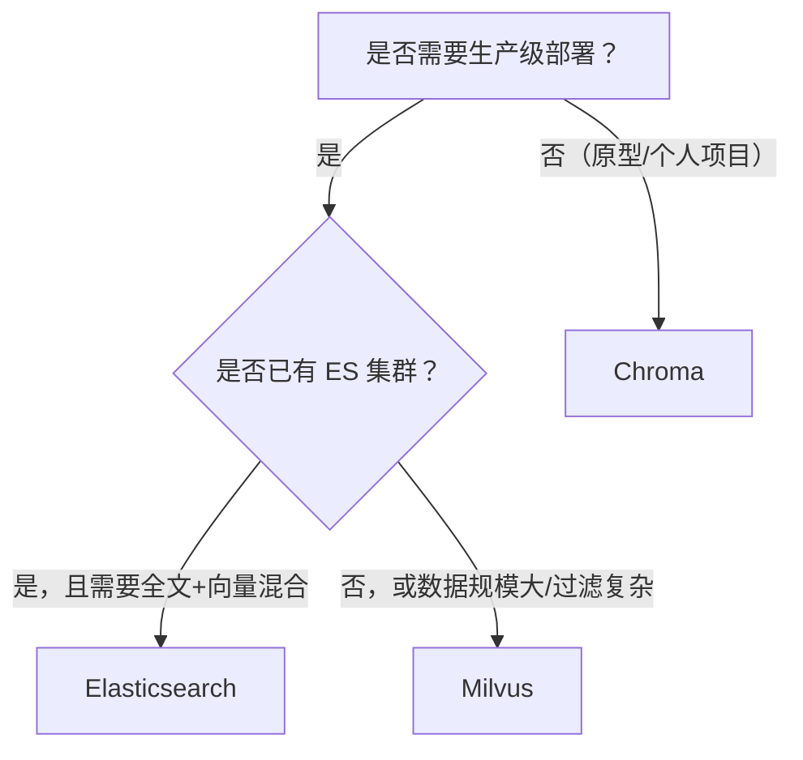

# Milvus、Chroma、ES做向量数据库的比较

在做 RAG、语义搜索、图片/音频检索这类 AI 应用时，几乎都会遇到同一个问题：向量数据存哪里、怎么检索。目前最常被拿出来比较的三个方案是 **Milvus**、**Chroma** 和 **Elasticsearch（ES）**。它们名字上都带"向量数据库"的标签，但定位完全不同：一个是专用分布式向量库，一个是嵌入式轻量库，一个是"顺手支持向量"的搜索引擎。本文从架构、能力、规模、运维等维度做一次系统对比，帮助你在不同场景下做出合适的选择。

## 1. 为什么需要向量数据库

传统数据库擅长按条件精确匹配（`WHERE id = 1`）或范围查询，但无法回答"哪条数据和这条最像"。向量检索的核心是**近似最近邻（ANN）**：把文本、图片等内容用 Embedding 模型转成高维向量（常见 768 到 2048 维），再在海量向量中快速找到距离最近的 Top-K 条。

向量数据库一般提供三件事：

- **存储**：向量的持久化、批量写入、增量更新。
- **索引**：HNSW、IVF、DiskANN 等 ANN 索引，把全量暴力扫描变成对数级查找。
- **过滤**：在向量相似度之外，配合标量字段（如分类、时间、用户 ID）做条件过滤。

三个方案对这三件事的侧重点和完成度差异很大，这正是选型的关键。

## 2. 三个方案是什么

### 2.1 Milvus：生产级专用向量数据库

Milvus 是 Zilliz 开源的分布式向量数据库（Apache 2.0），是国内和全球都广泛使用的专用向量库。

它把向量检索作为唯一核心，围绕大规模场景设计：

- **分布式架构**：Standalone 单机模式之外，支持集群部署，存储（对象存储）、元数据（etcd）、消息队列（Pulsar/Kafka）等组件可独立扩展。
- **索引丰富**：支持 IVF_FLAT / IVF_PQ、HNSW、DISKANN（磁盘索引，内存放不下时用），以及基于 GPU 的 CAGRA 等索引，可针对不同数据规模和硬件选型。
- **标量过滤强**：支持布尔表达式、IN、范围等过滤，配合分区（Partition）可以做很复杂的混合查询。
- **生态完整**：官方提供 Collection/Schema 管理、RBAC、监控（Prometheus）、Attu 可视化控制台，并深度集成 LangChain、LlamaIndex、Haystack 等框架。
- **轻量入口**：Milvus Lite 可以在单进程内嵌入式运行，方便本地开发和测试，与全量版 API 基本一致。

适合场景：**生产级 RAG、推荐系统、大规模知识库**，数据量达到千万甚至亿级，对并发和延迟有硬性要求。

### 2.2 Chroma：嵌入式轻量向量数据库

Chroma 是主打"简单、嵌入、开箱即用"的轻量向量数据库，Python 生态用户尤其熟悉。

特点：

- **嵌入式运行**：默认在应用进程内直接运行（底层 SQLite + HNSW），`pip install chromadb` 之后几行代码就能用，不需要部署任何服务。
- **API 极其简单**：`add` 写入、`query` 检索、自带 metadata 过滤，学习成本在三个方案里最低。
- **持久化友好**：数据落在本地目录，支持 `PersistentClient` 持久化，适合个人项目和原型。
- **支持 Client/Server**：也提供独立的 Server 模式，可以脱离进程单独跑，但仍是单机架构。

适合场景：**原型验证、个人项目、教学 Demo、数据量不大（几十万量级以内）的本地应用**。

### 2.3 Elasticsearch：搜索引擎 + 向量扩展

Elasticsearch 本身是成熟的开源全文搜索引擎，从 8.x 开始把向量检索作为一等公民纳入。

特点：

- **原生向量字段**：`dense_vector` 字段类型 + HNSW 索引，提供 kNN search API，支持近似检索和精确暴力检索。
- **全文 + 向量混合**：这是 ES 的最大差异化优势——可以在同一个查询里同时做 BM25 全文匹配和向量相似度，并用 RRF（Reciprocal Rank Fusion）合并排序，RAG 场景非常常用。
- **检索语法强大**：基于 Query DSL 的丰富过滤、聚合、排序能力，文本检索领域无可挑剔。
- **运维生态成熟**：分布式天然支持高可用、分片扩容，配套 Kibana 可视化，很多团队本来就有 ES 运维经验。

适合场景：**已有 ES 技术栈的团队、需要"全文 + 语义"混合检索、日志/搜索/向量一体化平台**。

## 3. 核心能力对比

| 维度 | Milvus | Chroma | Elasticsearch |
| --- | --- | --- | --- |
| 架构形态 | 专用分布式向量库（可选单机） | 嵌入式单机（可 Client/Server） | 分布式搜索引擎 |
| 部署复杂度 | 高（集群组件多；Standalone 中等） | 极低（进程内） | 中高（JVM、集群调优） |
| 主要索引 | HNSW、IVF_FLAT/PQ、DiskANN、GPU CAGRA | HNSW（hnswlib） | HNSW（Lucene） |
| 标量过滤 | 强（表达式 + 分区） | 基础（metadata 过滤） | 强（Query DSL） |
| 混合检索 | 一般（Sparse/BMM 支持逐步完善） | 不支持 | 原生（全文 + kNN + RRF） |
| 水平扩展 | 强 | 不支持（单机） | 强（分片） |
| 数据持久化 | 对象存储 | 本地文件（SQLite） | 磁盘 + 副本 |
| 多语言 SDK | 丰富（Python/Java/Go/Node 等） | 主要 Python/JS | 丰富（官方多语言客户端） |
| 集成生态 | LangChain/LlamaIndex/Haystack 等 | LangChain 等，文档齐全 | 各类框架 + 自家 Elastic 生态 |
| 学习成本 | 高 | 低 | 中 |
| 运维成本 | 高（集群） | 无（进程内） | 中高 |
| 适合数据规模 | 十万 ~ 十亿级 | 十万级以内 | 百万级（受内存/调优影响） |
| 典型场景 | 生产 RAG、推荐、大规模知识库 | 原型、个人项目、Demo | 全文+语义混合、日志搜索平台 |

## 4. 性能和规模经验

以下数字是大致的经验参考，实际受硬件、索引参数、向量维度、过滤条件影响很大：

- **十万级以内**：Chroma 完全够用，省心省钱。
- **十万 ~ 千万级**：ES 可以承担，但要注意 HNSW 索引常驻内存，字段多、分片多会显著抬内存；需要评估 Query DSL 过滤对延迟的影响。
- **千万 ~ 亿级及以上**：Milvus 更合适，可横向扩展，还能用 DiskANN 把索引放到磁盘、用 GPU 索引压延迟。
- **过滤条件复杂**：如果每个查询都带大量标量过滤，Milvus 和 ES 都强于 Chroma；Chroma 的过滤能力较弱且会退化性能。

一点提醒：ES 的 kNN 检索性能和专用向量库相比仍有差距，它更适合"用一套系统同时解决全文和向量"的场景，而不是追求极致的向量吞吐。

## 5. 选型建议



按场景归纳：

- **个人博客 RAG、课程 Demo、本地小工具**：Chroma，几分钟跑通，无需运维。
- **公司已有 ES 技术栈，搜索平台想顺带支持语义检索**：ES，物尽其用，避免多维护一套系统。
- **生产级 RAG/知识库，数据量大、并发高、过滤复杂**：Milvus，专用能力 + 分布式扩展。
- **需求可能快速增长**：优先选 Milvus 或"Chroma 起步、接口预留切换"的方式，因为 Chroma 到大规模生产之间的升级路径不如 Milvus 顺畅。

## 6. 快速上手对比

### Chroma（Python）

```python
import chromadb

client = chromadb.PersistentClient(path="./chroma_data")
collection = client.get_or_create_collection("demo")

collection.add(
    ids=["1", "2"],
    embeddings=[[0.1, 0.2, 0.3], [0.9, 0.8, 0.7]],
    metadatas=[{"category": "a"}, {"category": "b"}],
    documents=["第一篇文档", "第二篇文档"],
)

results = collection.query(
    query_embeddings=[[0.11, 0.21, 0.31]],
    n_results=2,
    where={"category": "a"},
)
```

### Milvus（Python）

```python
from pymilvus import MilvusClient

client = MilvusClient("./milvus_demo.db")  # 本地模式，也可连接服务器

client.create_collection(
    collection_name="demo",
    dimension=3,
    metric_type="IP",
)

client.insert(
    collection_name="demo",
    data=[
        {"id": 1, "vector": [0.1, 0.2, 0.3], "category": "a"},
        {"id": 2, "vector": [0.9, 0.8, 0.7], "category": "b"},
    ],
)

results = client.search(
    collection_name="demo",
    data=[[0.11, 0.21, 0.31]],
    limit=2,
    filter='category == "a"',
    output_fields=["category"],
)
```

### Elasticsearch（REST）

```json
PUT /demo
{
  "mappings": {
    "properties": {
      "vector": {
        "type": "dense_vector",
        "dims": 3,
        "index": true,
        "similarity": "cosine"
      },
      "category": { "type": "keyword" }
    }
  }
}

GET /demo/_search
{
  "knn": {
    "field": "vector",
    "query_vector": [0.11, 0.21, 0.31],
    "k": 2,
    "num_candidates": 10,
    "filter": { "term": { "category": "a" } }
  }
}
```

可以看到：Chroma 强调"开箱即用"，Milvus 强调"结构化管理"，ES 强调"索引和查询 DSL 的表达力"。三者都能完成基础检索，差别在规模、复杂度和运维。

## 7. 总结

没有"最好"的向量数据库，只有"最合适"的：

- **要快、要省心、数据量小** → Chroma。
- **要全文 + 向量一体、已有 ES 团队** → Elasticsearch。
- **要生产级大规模向量检索** → Milvus。

选型时建议先回答三个问题：数据量到多少？是否需要全文混合检索？团队能承担多少运维成本？答案清晰之后，上面的对比表基本就能给出结论。如果需求还在早期，先用 Chroma 快速验证产品，同时保持数据访问层抽象，未来切换到 Milvus 或 ES 的成本会低很多。
